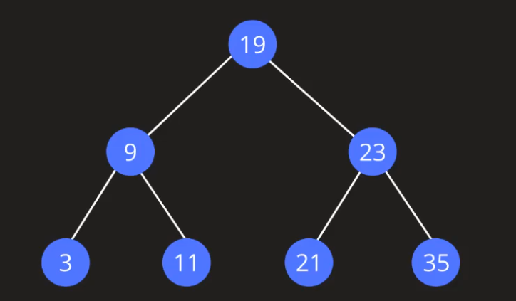

# Binary trees

With binary trees, each node can have maximum of two child.

Types of binary tree:
- Full Binary Tree: every node has 0 or 2 children.
- Complete Binary Tree: all levels are completely filled with nodes except the last level. In the
last level, all the nodes are as left side as possible.
- Perfect Binary Tree: all internal nodes have 2 children and all the leaf nodes are at the same depth
or at the same level.
- Balanced Binary Tree: height of the left and the right sub-trees of every node may differ by at most 1.
- Degenerate Binary Tree: every parent node has only one child node.

## Binary Search Tree

In BTS, compared to root node, all the elements in its left are going to be less than the root node 
value, and all the element on its right are going to be greater than the root node value. In short, 
all the elements in left subtree are going to be lesser, and all the elements on right subtree are 
going to be greater.

Types:
- Balanced BST: height of the left and the right sub-trees of every node may differ by at most 1. 
Height is `log n`.
- Unbalanced BST: height difference of the left and the right sub-tree is greater than one. 
Height is `n`.

## Complexities

Access operation is same as search.

Delete operation can happen in multiple cases:
- Deleting node with 0 child
- Deleting node with 1 child
- Deleting node with 2 children

| **Search**                             | **Insertion**                          | **Deletion**                           |
|----------------------------------------|----------------------------------------|----------------------------------------|
| Average case O(log n), worst case O(n) | Average case O(log n), worst case O(n) | Average case O(log n), worst case O(n) |
