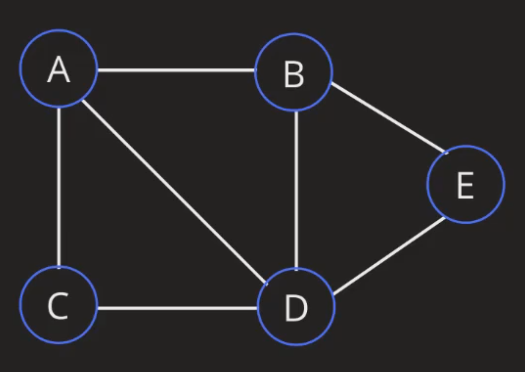

# Graphs

Graph is a non-linear data structure. It consists of nodes and edges. 
Nodes are also referred to as vertex.

## Undirected graph

There is a connection between two nodes in both directions.

## Directed graph

There is connection between two nodes in one or two directions. Example of one directed graph is tree.

## Unweighted graph

Equal weightage is given to all connections.

## Weighted graph

Each connection is given a value.

## Cyclic graph

Start from a node, traverse and get back to it. It is a closed loop.

## Acyclic graph

It is not a closed loop.

## Implementation

Graphs can be implemented with Adjacency Matrix, Adjacency List or Edge List.
