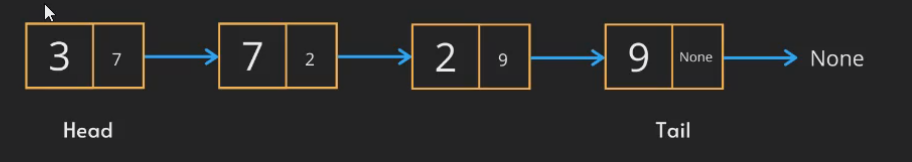
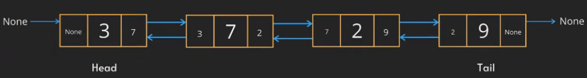

# Linked lists

There are two types of Linked lists:
- Singly linked lists
- Doubly linked lists

## Singly linked lists

Each node contains a value and a memory address of the next node. It requires extra space compared 
to arrays, because it also contains a memory address of the next node.

## Doubly linked lists

In doubly linked lists, information is stored for the next and the previous node as well.

## Complexities

| **Access** | **Search**  | **Insertion**                        | **Deletion**                         |
|------------|-------------|--------------------------------------|--------------------------------------|
| O(n)       | O(n)        | O(1) if position is known, else O(n) | O(1) if position is known, else O(n) |
