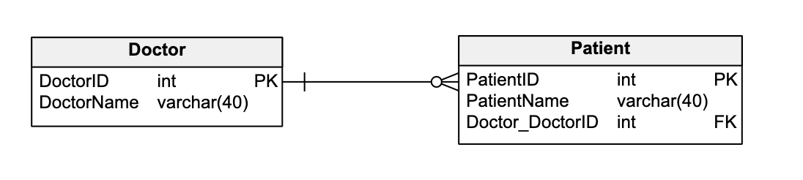
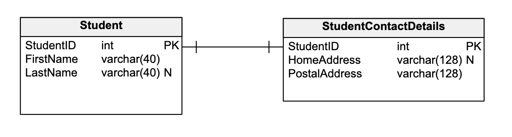
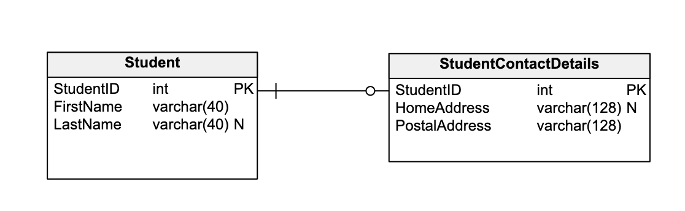
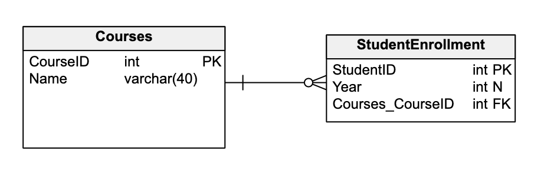
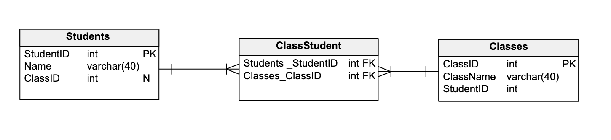

# Cardinality

Cardinality is a mathematical term. It translates into the number of elements in a set. In databases, cardinality refers to the relationships between the 
data in two database tables. Cardinality defines how many instances of one entity are related to instances of another entity.

## Optionality

A concept related to cardinality is optionality. Optionality represents whether an entity on one side must be joined to an entity on the other side.

The mandatory nature of cardinality is represented by a vertical line or segment (|) on the mandatory side(s) 
of the horizontal line connecting the two entities. Optionality is denoted by an empty circle on the
optional side(s) of the line connecting the two entities

## The One-To-One Relationship

The one-to-one (1:1) relationship defines the fact that one row in a database table relates to
exactly one row in a second table. 

The 1:1 relationship is notated in an ER diagram with a single line connecting the two entities.
The two perpendicular lines (|) indicate a mandatory relationship between the two entities. In other 
words, the student must have contact details, and the contact details must have a related student.

Optionality is notated by an empty circle. In this scenario, the Student entity does not have
to have a corresponding Student Contact Details record.

## The One-To-Many Relationship

The one-to-many (1:N) relationship is the most common database relationship. It is used to indicate 
the relationship between the majority of tables found in a relational database.

In summary, the one-to-many relationship means that one row in a database table relates to many rows in a second table.
It is also known as a Primary Key-Foreign Key relationship because it uses primary keys and foreign keys to enforce
this relationship.

single vertical line (on the left side of this relationship line) indicates that this connector only has one row affected by this relationship.

The crow’s foot with an open circle indicates that this connector has many rows influenced by this relationship. The open circle indicates optionality.
In other words, there does not have to be a student enrollment record linked to a course.

## The Many-To-Many Relationship

The many-to-many (M:N) relationship means that many rows in one table are related to many rows in a second table. 
In other words, many instances in one entity correlate with many instances in a second entity. For example, 
a student can sign up for many classes, and a class can have many students signed up.

A direct many-to-many relationship between these two example entities is not possible. Cross-reference
table is required to represent this kind of relationship in the table. Cross-reference table is also 
called junction table.

Resources:
- https://vertabelo.com/blog/cardinality-in-data-modeling/

