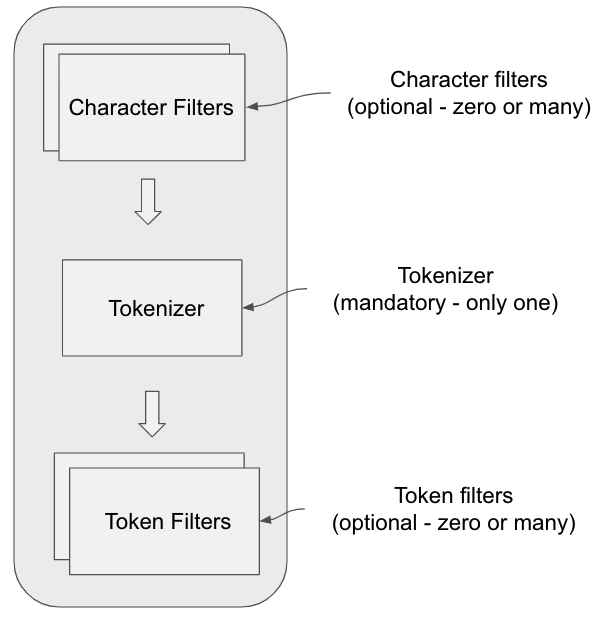

# Full Text Search

Full-text search refers to searching some text inside extensive text data stored electronically and 
returning results that contain some or all of the words from the query. In contrast, 
traditional search would return exact matches.

## String searches vs Full-text search

String searches are algorithms that search for consecutive characters in a larger text field. 
Those searches will be performed character per character and can be relatively slow.

Another technique often used for string searches is the use of regular expressions. 
Those expressions represent a search pattern and are supported by most modern programming languages.

In a SQL database, a search on a text field in a record is usually done using a LIKE operator.

These searches are easy to use and can work well on small data sets. However, because they are not
utilizing indexes optimally, those could quickly become problematic once you need blazing fast results 
for autocomplete suggestions, for example.

Full-text search is meant to search large amounts of text. For example, a search engine will use a full
-text search to look for keywords in all the web pages that it indexed. The key to this technique is
indexing.

Indexing can be done in different ways, such as batch indexing or incremental indexing.
The index then acts as an extensive glossary for any matching documents. Various techniques can then
be used to extract the data. Apache Lucene, the open sourced search library, uses an inversed index
to find the matching items. 

This technique is much faster than string searches for large amounts of data. However, 
these indexes require some disk space and can consume a lot of resources when created.

## Indexing

The key to an efficient full-text search is index creation. Essentially, the index creation process 
goes through each text field of a dataset. For each word, it will start by removing any diacritics 
(marks placed above or below letters, such as é, à, and ç in French). Then, based on the used 
language, the algorithms will remove filler words and only keep the stem of the terms. 
This way, “to eat,” “eating,” and “ate” are all classified as the same “eat” keyword. 
It then changes the casing to use only either uppercase or lowercase. The exact indexing process is 
determined by the analyzer that is used.

The index is then created by adding each of these words with a reference to which document it can be found in.

## Implement full-text search in SQL

To implement a full-text search in a SQL database, you must create a full-text index on each column
you want to be indexed. In MySQL, this would be done with the FULLTEXT keyword.

Then you will be able to query the database using MATCH and AGAINST.

```
ALTER TABLE menus ADD FULLTEXT(item);
SELECT * FROM menus WHERE MATCH(item) AGAINST("pasta");
```

While this index will increase the search speed for your queries, it does not provide you with all 
the additional capabilities that you might expect. To use features such as fuzzy search, typo 
tolerance, or synonyms, you will need to add a core search engine such as Apache Lucene on top of 
your database.

## Analyzers

An analyzer module consists of essentially three components – character filters, the tokenizer and
token filters:
1. Character filters (optional) are applied to the text being analyzed to strip out characters.
2. A tokenizer breaks text into tokens or terms. This can be done in different ways, generating tokens by whitespace, by letters, etc.
3. Token filters (optional) perform additional changes on tokens, like converting to lowercase, removing specific tokens, and more.

These three components form a pipeline that each of the text fields pass through for text processing.
While both character and token filters are optional in a text analysis pipeline, the tokenizer is a
mandatory component.



## Inverted Index

In computer science, an inverted index (also referred to as postings file or inverted file) is an
index data structure storing a mapping from content, such as words or numbers, to its locations in a 
database file, or in a document or a set of documents.

This type of index is called an inverted index, because it inverts a page-centric data structure
(page->words) to a keyword-centric data structure (word->pages).

The traditional index method in most databases is the B-tree
(and its various sub-implementations: B+-tree, B*-tree, etc). In most row-structured database engines, every row in the
table being indexed gets a row in the B-Tree, with the "index row" containing indexed column(s), some sort of lookup
identifier back to the base table data.

B-Trees using row-structured data have several useful properties:
- They are ordered, allowing both equality and searches that make use of order (ie, <, >, prefix LIKE).
- They are relatively easy to insert into and update as rows stream in, allowing them to be always up-to-date for queries as rows are inserted.

Inverted indexes are not row-structured; the thing they're most similar to is a dictionary. 
Each unique value in the index gets an index entry, followed by some sort of list of row offsets or IDs with that value.
This list is often represented with a simple bitmap or compressed bitmap with the i'th bit representing the i'th row in the table being indexed: 1 for value there, 0 for not.

The big advantage of inverted indexes over row-structured indexes is they're excellent for representing
frequently-appearing values (Cardinality (SQL statements)), which is why they're great for search engines and other types of full-text indexes. They're also great for complex
search logic on the lookup values, which can be turned into a bunch of bit-ands and bit-ors on the bitmap lists.

The big downside of inverted indexes is their fastest implementations, namely the ones that use bitmaps, are hard to
update, and often have to be fully rebuilt every time the database is updated. These types of inverted indexes are used
for load-and-read workloads like search engines.

Resources:
- https://www.joshgraham.com/full-text-search-explained/
- https://www.mongodb.com/basics/full-text-search
- https://opster.com/guides/elasticsearch/data-architecture/elasticsearch-text-analyzers/