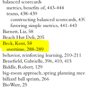
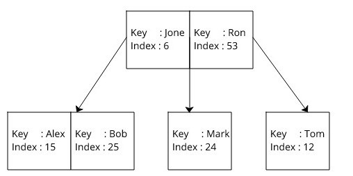

# Database indexing

Database indexing is analogous to indexes in books. You can find them at the back of the books and they contain
the list of concepts and for every concept there is a list of page numbers where it is mentioned. Indexes in books and 
databases serve the same purpose: a quick way to look up the location of information you want to find.



By looking in the index you can quickly see the pages where the mentioned. If there was no index, you would have to
go through every page to look for it. Same idea applies to databases. 

For example, if you have persons database, and you want to search persons by the `firstName` column. You would use a query that looks like this:

```
select * from persons where firstName = ‘Bob‘
```

If there was an index on `firstName` column, the database engine will use logical categorisation of each record
by the first name to quickly find where that record is physically located on the disk drive(this is called **index seek**). 
If you had the same search scenario without an index on `firstName`, the database engine would have to look at every record to see if 
it matched the condition(this is called **table scan**). There is also such a thing called an **index scan**. It happens
when an index does exist but the database engine decides it is quicker to look at the records one by one anyway. These are the
scenarios when the database engine decides to use **index scan**:
- the table size is small,
- the requested records make up a large percentage of total records in the database table.

Generally speaking seeking is good and scanning is bad.

## How are indexes implemented?

As already mentioned, indexes represent logical categorisation of table records by specific column.
Indexes can be implemented in different ways, using **B-trees**, **Hash tables** or something else.

SQLite database for example, is using  **B-tree** data structure.
**B-tree** is a data structure that provides sorted data and allows searches, sequential access, attachments, and removals in sorted order.
B-tree stores data such that each node contains keys in ascending order. Each of these keys has two references to another two child nodes. The left side child node keys are less 
than the current keys and the right side child node keys are more than the current keys. If a single node has `n` number of keys, then it can have maximum `n+1` child nodes.

For example, we can have the following table representing person data:

| firstName | city      | age |
|-----------|-----------|-----|
| Jone      | New York  | 28  |
| Alex      | Chicago   | 45  |
| Tom       | Paris     | 23  |
| Ron       | London    | 13  |
| Mark      | Liverpool | 48  |
| Bob       | Dublin    | 32  |

The resulting B-tree for `firstName` index could look like this:



Here, index is a reference to the actual data record, which is stored as a byte stream in another data structure.
As shown in the diagram, keys are sorted lexicographically in the nodes. When searching for a key,
B-tree lookup algorithm is used, which takes `O(log n)` time to search any element in a B-tree. When index is found, it 
is used to obtain the payload.

## Cost of adding indexes

When index is created for a specific column, this means that underlying structure for maintaining indexes
will have to be updated on every insert, delete or update. Also, database indexes require extra space too. 
The specific amount will depend on the size of the table and the number of columns in the index.

Resources:
- https://dltlabs.medium.com/introduction-to-indexing-in-databases-1a85295e4acf
- https://davecallan.com/introduction-to-database-indexes/
- https://www.geeksforgeeks.org/indexing-in-databases-set-1/
- https://www.youtube.com/watch?v=C_q5ccN84C8
- https://dzone.com/articles/database-btree-indexing-in-sqlite
- https://www.oreilly.com/library/view/database-internals/9781492040330/ch04.html
- https://stackoverflow.com/questions/1108/how-does-database-indexing-work
