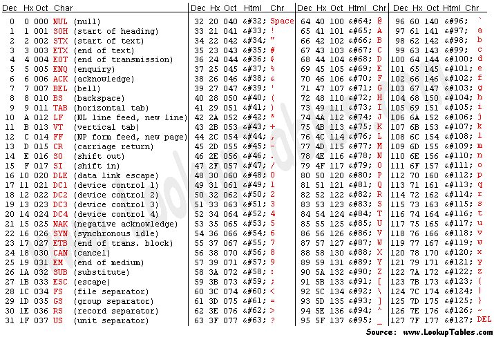

## ASCII encoding

ASCII is a mapping, from binary to alphanumeric characters.

In the early days of the internet, it was English only. We didn't need to worry about any other 
characters and the American Standard Code for Information Interchange (ASCII) was the character 
encoding that fit this purpose.

One byte (eight bits) is large enough to fit every English character, and some control characters too.
One byte can store all our control characters, all our numbers, all the English characters and have
some left! Because one byte can encode 255 characters, and ASCII only needed 127 characters. 
So there are 128 encodings that are unused.

Below is the ASCII character table:

All lowercase and uppercase A-Z and 0-9 are encoded to binary numbers. Remember 
the first 32 are unprintable control characters.

Issue with ASCII it that there was a lot of implementation for the 128-255 encodings.
These different endings for ASCII were called code pages. ASCII was hard to standardize to 
work between different languages and codepages so that is why Unicode was introduced.

Resources:
- https://www.freecodecamp.org/news/everything-you-need-to-know-about-encoding/