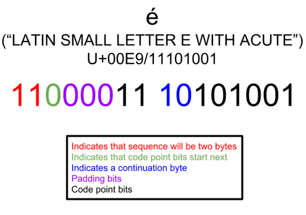

# Unicode encoding

Unicode entered the scene to help solve the problems that encoding and ASCII code pages were causing.

Unicode is made up of lots of code points (mapping lots of characters from around the world to a key that all computers can reference.)
A collection of code points is called a character set - which is what Unicode is. Unicode is sometimes called the **Universal Coded Character Set (UCS)**, 
or even **ISO/IEC 10646**.

This is an example of "Hello World" mapped to Unicode:

**"Hello World"**

**U+0048 : LATIN CAPITAL LETTER H**

**U+0065 : LATIN SMALL LETTER E**

**U+006C : LATIN SMALL LETTER L**

**U+006C : LATIN SMALL LETTER L**

**U+006F : LATIN SMALL LETTER O**

**U+0020 : SPACE [SP]**

**U+0057 : LATIN CAPITAL LETTER W**

**U+006F : LATIN SMALL LETTER O**

**U+0072 : LATIN SMALL LETTER R**

**U+006C : LATIN SMALL LETTER L**

**U+0064 : LATIN SMALL LETTER D**

The U+ lets us know it's the Unicode standard, and the number is what results when the binary 
get's transformed to numbers. It uses hexadecimal notation which is just a simpler way of 
representing binary numbers.

At this point we have a big dictionary of code points mapping to characters. This is where
**Unicode Transform Protocol (UTF)** comes into picture.

## Unicode Transform Protocol (UTF)

UTF is a way we encode Unicode code points. The UTF encodings are defined by the Unicode standard, 
and are able to encode every single Unicode code point we need.

But there are different types of UTF standards. They differ depending on the amount of bytes used to
encode one code point. It also depends on whether you're using **UTF-8** (one byte per code point), **UTF-16** 
(two bytes per code point) or **UTF-32** (four bytes per code point).

If we have these different encodings, how do we know which encoding a file will use? There's a thing called a **Byte Order Mark (BOM)** - 
sometimes referred to as an Encoding Signature. The BOM is a two-byte marker at the beginning of a file that tells what encoding the file is using.

**UTF-8** is the most used on the internet, and is also specified in HTML5 as the preferred encoding for new documents.

## UTF-8

UTF-8 is a variable-width character encoding standard that uses between one and four eight-bit bytes to represent all valid Unicode code points.

UTF-8 encodes all the Unicode code points from 0-127 in 1 byte (the same as ASCII). This means that if you were coding your program using ASCII,
and your users used UTF-8, everything would work as expected.

Because it's called UTF-8, remember that's the minimum number of bits (8 bits being one byte!) that a code point will be.
There are other Unicode characters that are stored in multiple bytes. 
This is what people mean when the encoding is called variable length.

When you need a character to span more than one byte, you have a bit combination to identify a continuation sign, 
saying this character is continued over the next several bytes. So you’ll still only use one byte per character for English, 
but if you need a document to contain some foreign characters, you can do that too.


Each byte starts with a few bits that tell you whether it's a single byte code-point, a multi-byte code point, 
or a continuation of a multi-byte code point. Like this:

 ```
 0xxx xxxx    A single-byte US-ASCII code (from the first 127 characters)
 ```

The multi-byte code-points each start with a few bits that essentially say "hey, you need to also read the 
next byte (or two, or three) to figure out what I am." They are:

```
110x xxxx    One more byte follows
1110 xxxx    Two more bytes follow
1111 0xxx    Three more bytes follow
```

Finally, the bytes that follow those start codes all look like this:

```
10xx xxxx    A continuation of one of the multi-byte characters
```

**Example for the French letter é:**

Unicode assigns the French letter é to the code point U+00E9. This is 11101001 in binary; it is not part of the ASCII character set. UTF-8 represents this eight-bit number using two bytes.

The leading bits of both bytes contain meta-data. The first byte begins with 110. The 1s indicate that this is a two-byte sequence, and the 0 indicates that the code point bits will follow. The second byte begins with 10 to signal that it is a continuation in a UTF-8 sequence.

This leaves 11 “slots” for the code point bits. Remember that the U+00E9 code point only requires eight bits. UTF-8 pads the leading bits with three 0s to fully “fill out” the remaining spaces.

The resulting UTF-8 representation of é (U+00E9) is 1100001110101001.



Resources:
- https://www.freecodecamp.org/news/everything-you-need-to-know-about-encoding/
- https://www.twilio.com/docs/glossary/what-utf-8