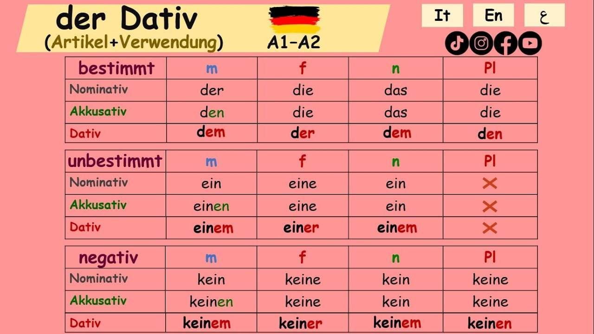

# German Articles

Articles are words like “a,” “an,” and “the”. These short articles precede nouns that can be people, places, or things.

There are two general categories of articles:

- **Definite Articles** – In English, we use the word “the” to talk about a specific person, idea, or object. The three main definite articles in German are `der`, `die`, and `das`.
- **Indefinite Articles** – The words “a” and “an” allow us to speak about more generic people, places, or objects. In German, words like `ein` and `eine` are the equivalent.

In German, definite articles change according to their gender, case, and number.

## Definite Article Adjective Endings

In addition, if you want to add an adjective between the definite article and a noun, you'll need to add an appropriate German adjective ending. 

| **Adjective Endings** | **Masculine** | **Feminine** | **Neuter** | **Plural** |
|-----------------------|---------------|--------------|------------|------------|
| **Nominative**        | -e            | -e           | -e         | -en        |
| **Accusative**        | -en           | -e           | -e         | -en        |
| **Dative**            | -en           | -en          | -en        | -en        |

## Indefinite Article Adjective Endings

If you want to use an adjective after an article and before the noun, the adjective will need an ending.

| **Adjective Endings** | **Masculine** | **Feminine** | **Neuter** |
|-----------------------|---------------|--------------|------------|
| **Nominative**        | -er           | -e           | -es        |
| **Accusative**        | -en           | -e           | -es        | 
| **Dative**            | -en           | -en          | -en        | 

## Articles and Genders

Firstly, some German noun genders are biologically determined.
- **Masculine** – Der Mann (the man), der Vater (the father), der Student (the male student), der Lehrer (the male teacher), der Mitarbeiter (the male employee), etc.
- **Feminine** – Die Frau (the woman), die Mutter (the mother), die Studentin (the female student), die Lehrerin (the female teacher), die Mitarbeiterin (the female employee), etc.
- **Neuter** – Das Baby (the baby), das Kind (the child), das Haus (the house)

Secondly, most occupational names have both masculine and feminine versions, depending on the gender of the person. In contrast, other German nouns follow grammatical gender patterns.

Note that in English, we refer to objects as “it.” But in German, you use a pronoun that corresponds with the noun's gender, `er`, `sie`, or `es`.

General guidelines:
- Firstly, over 65% of one-syllable words in German are masculine.
- Secondly, some suffixes are almost always masculine, like ant, er, and or.
- Thirdly, endings such as heit, keit, and ung are feminine.
- And finally neuter endings include chen, lein, um, and o. 

### Masculine Nouns And The Article der

Masculine Nouns And The Article der

Firstly, below are the suffixes that tend to indicate the masculine gender (der):
- **ant** – Diamant (diamond), Elefant (elephant), Praktikant (intern)
- **ent** – Student (student), Patient (patient), Assistent (assistant), Dozent (professor)
- **er** – Fahrer (driver), Maler (painter), Spieler (player)
- **ich** – Teppich (carpet), Rettich (radish)
- **ismus** – Kapitalismus (capitalism), Tourismus (tourism), Alkoholismus (alcoholism)
- **ist** – Kapitalist (capitalist), Tourist (tourist), Kommunist (communist)
- **ling** – Zwilling (twin), Frühling (spring)
- **or** – Autor (author),  Diktator (dictator), 

In addition, other masculine nouns include:
- **Seasons** – der Sommer (the summer), der Herbst (the fall), der Winter (the winter)
- **Months** – der Januar (January), der Februar (February), der März (March)
- **Days** – der Montag (Monday), der Dienstag (Tuesday), der Mittwoch (Wednesday)
- **Map and compass directions** – der Norden (north), der Suden (south), der Westen (west), der Osten (east)
- **Cars and trains** – der BMW, der Volkswagen, der Mercedes
- **Many currencies** – der Euro, der Dollar, der Cent
- **Most mountains or lakes** – der Mount Everest, der Mississippi, der Montblanc

### Feminine Nouns And The Article die

Secondly, below are the tell-tale suffixes of feminine nouns (die):
- **e** – Blume (flower), Summe (sum), Katze (cat)
- **ei** – Polizei (police), Datei (data), Konditorei (confectionary)
- **heit** – Freiheit (freedom), Gesundheit (health), Sicherheit (security)
- **ie** – Garantie (guarantee), Fantasie (fantasy), Ökonomie (economy)
- **ik** – Grammatik (grammar), Mathematik (math), Musik (music)
- **ion** – Nation (nation), Funktion (function), Produktion (production)
- **ität** – Nationalität (nationality), Autorität (authority), Spontaneität (sponteneity)
- **keit** – Aufmerksamkeit (attention), Schwierigkeit (difficulty)
- **schaft** – Freundschaft (friendship), Landschaft (landscape), Gemeinschaft (community)
- **ung** – Erfahrung (experience), Empfehlung (recommendation), Zeitung (newspaper)
- **ur** – Natur (nature), Kultur (culture), Agentur (agency)

Other feminine nouns also include:
- **Names of flowers** – die Rose (rose), die Tulpe (tulip)
- **Names of trees** – die Kiefer (pine), die Buche (beech), die Eiche (oak)
- **Most fruits** – die Birne (pear), die Zitrone (lemon), die Melone (melon)
- **Cardinal numbers** – die Eins (one), die Zwei (two), die Drei (three)

In addition, feminine occupations add the ending –in.

### Neuter Nouns And The Article das

Finally, the endings below usually indicate neuter (das) nouns.
- **chen** – Mädchen (girl), Häuschen (little house), 
- **lein** – Häuslein (little house), Mäuslein (little mouse), Fräulein (young woman)
- **ma** – Thema (topic), Drama (drama), Schema (diagram)
- **ment** – Moment (moment), Dokument (document), Experiment (experiment)
- **nis** – Geheimnis (secret), Gefängnis (jail), Kenntnis (knowledge)
- **tel** – Hotel (hotel), Viertel (quarter)
- **tum** – Eigentum (property), Königtum (kingdom), Christentum (christianity)
- **um** – Aquarium (aquarium), Museum (museum)

However, it's important to note that there are exceptions to the rules.

## Compound Noun Genders

In addition, many words in German combine multiple nouns into a new word.

For example:
- die Baustelle (construction site)
- der Fahrplan (the timetable)
- das Kinderbuch (children's book)

In most cases, the last word of the compound noun determines the gender. But, as usual, there are a few exceptions to the rule.
- der Teil (part) – Some compound nouns with Teil take neuter articles: das Gegenteil (opposite), das Einzelteil (individual part), das Abteil (compartment), das Oberteil (top piece), das Ersatzteil (replacement part), das Urteil (verdict).
- der Mut (courage) – Many compound nouns containing Mut take feminine articles: die Armut (poverty), die Wehmut (sorrow), die Demut (humility), die Anmut (grace), die Großmut (generosity), die Langmut (patience).

## Plural German Articles

Plural nouns always use the article die in the nominative and accusative cases.
- das Mädchen (the girl) – die Mädchen (the girls)
- der Junge (the boy) – die Jungs/Jungen (the boys)
- der Mann (the man) – die Männer (the men)

But in the dative plural case, die changes to den.
- Ich gab den Mädchen Hausaufgaben. (I gave the girls homework.)
- Wir waren überrascht, von den Jungs zu hören. (We were surprised to hear from the boys.)
- Er war beeindruckt von den Männern und ihrer Arbeit.

## Possessive Determiners (Possessivartikel)

They indicate who owns what and thus show ownership and affiliation.

Possessive Articles come before the noun.

Example:
- Das ist Anna. Ihre Katze spielt im Garten.
  The form of the Possessive Article depends on the Person it is referring to.
- Only the reference person (the "owner") determines which Possessive Articles we use, not the case, gender or number.

| **Owner** | **Possesive Article** | 
|-----------|-----------------------|
| ich       | mein                  |
| du        | dein                  |
| Er        | sein                  |
| es        | sein                  |
| sie       | ihr                   |
| wir       | unser                 |
| ihr       | euer                  |
| sie/Sie   | ihr/Ihr               |

Possessive Articles have to be declined, just like all Articles.
The Declension is based on the noun that comes after the Possessive Article (what is "owned" or what "belongs" to someone)
Declension is the same for all Possessive Articles (meinem, deinem, seinem, ihrem, unserem,...) and is based on the gender, case and number of the noun that is "owned" (and that comes after the Possessive Article).

|                | **Masculine** | **Feminine** | **Neuter**    | **Plural**     |
|----------------|---------------|--------------|---------------|----------------|
| **NOMINATIVE** | mein Mann     | meine Frau   | mein Kind     | meine Sterne   |
| **ACCUSATIVE** | meinen Mann   | meine Frau   | mein Kind     | meine Sterne   |
| **DATIVE**     | meinem Mann   | meiner Frau  | meinem Kind   | meinen Sternen |
| **GENITIVE**   | meines Mannes | meiner Frau  | meines Kindes | meiner Sterne  |

## Zero Article (Nullartikel)

In some cases, Nouns come without Articles. When there is no Article, we call that the Zero Article.

There is no article in these cases:

###  The Indefinite Article in Plural Form
- Dort steht ein Auto. - Dort stehen Autos.
- Hast du einen Stift mitgebracht? - Hast du Stifte mitgebracht?

### Names of People and Companies that don't have an  Adjective in front of them
- Ich arbeite mit Max.
- Ich arbeite bei Siemens.

### After Size, Weight or Number descriptions
- Ich möchte bitte eine Tasse Tee.
- Die Brauerei braut jeden Tag 10.000 Liter Bier.
- Ich hätte gern 100g Mortadella.
- Ich möchte gern 10 Eier.

### For Nationalities and Languages
- Olga ist Russin.
- Sie will Deutsch lernen.
- Pedro ist Spanier.
- Er spricht schon Deutsch.

Resources:
- https://storylearning.com/learn/german/german-tips/german-articles
- https://easy-deutsch.com/articles/