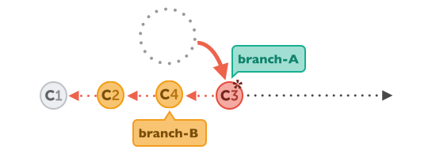

# Git Rebase

Unlike `merge`, that squashes all the commits into one merge commit, `rebase` preserves the original commits. After the rebase, commits structure is in the single line.

This is the example of the situation before the rebase:


If we want to integrate changes from branch-B into branch-A, we will use the following command:

```
git rebase branch-B
``` 

First, Git will temporary remove all changes on branch-A that happened after common ancestor commit(C1):


Next, all the commits from branch-B are applied:


In the final step, commits from branch-A that were temporary removed are now replayed. But they will be in new position, on top of the integrated commits from branch-B. This is the resulting structure:



Resources:
- https://www.git-tower.com/blog/understanding-rebase-merge-in-git/
- https://stackoverflow.com/questions/804115/when-do-you-use-git-rebase-instead-of-git-merge
