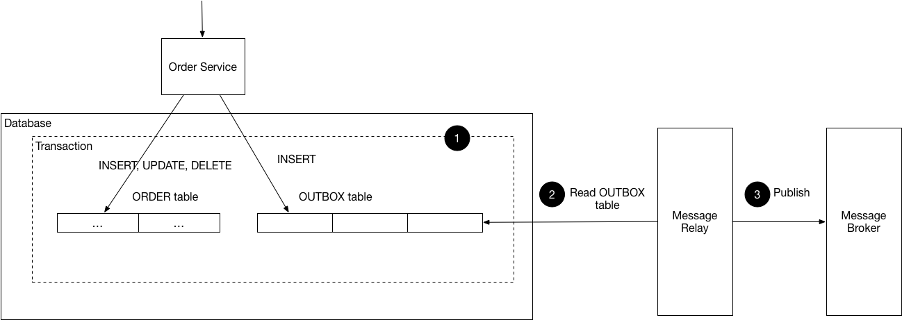

# Transactional Outbox

Transaction outbox pattern is used in architecture with multiple microservices
that have their own databases. When you need to implement transactions that span 
multiple services, you can use message broker to notify all the services about the changes.
To do this in a reliable way it is required to update the database and send a message atomically. 
A way to achieve this is to implement the Transactional outbox pattern.

A service that uses a relational database inserts messages/events into an outbox table (e.g. MESSAGE) as part of the local transaction.
A separate Message Relay process publishes the events inserted into database to a message broker.

This pattern has the following benefits:
- 2PC is not used
- Messages are guaranteed to be sent if and only if the database transaction commits
- Messages are sent to the message broker in the order they were sent by the application

This pattern has the following drawbacks:
- Potentially error prone since the developer might forget to publish the message/event after updating the database.

Resources:
- https://microservices.io/patterns/data/transactional-outbox.html