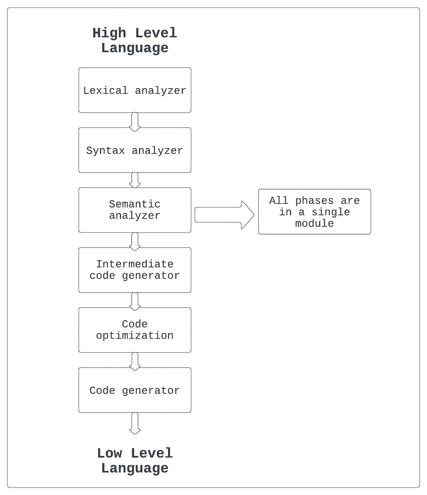
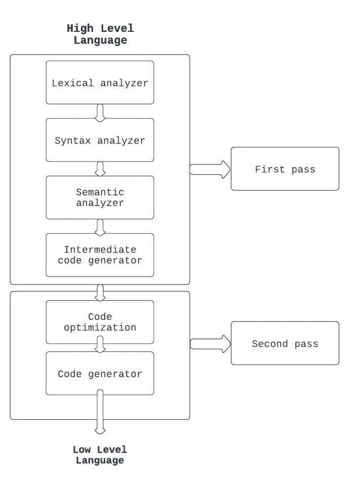
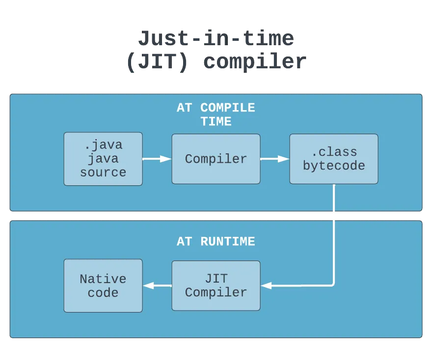
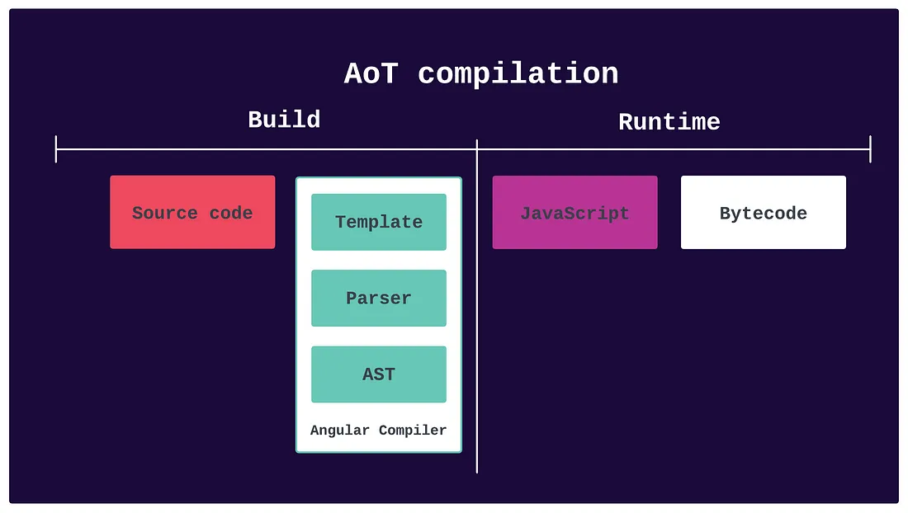
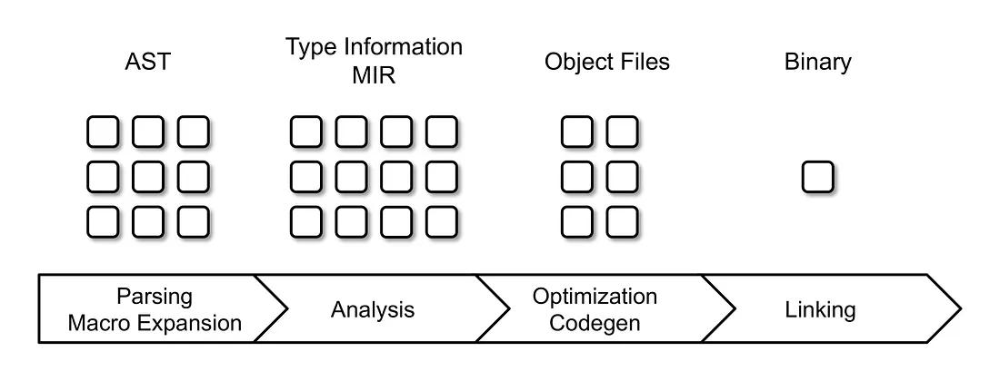

# Compiler

In computing, a compiler is a computer program that translates computer code
written in one programming language (the source language) into another
language (the target language). The name "compiler" is primarily used
for programs that translate source code from a high-level programming
language to a low-level programming language (e.g. assembly language,
object code, or machine code) to create an executable program.

The process of compiling involves several steps. First, the compiler reads the source code and performs lexical
analysis,
which involves breaking the code into individual tokens (such as keywords, identifiers, and operators). Next, the
compiler performs syntax analysis, which involves checking the code for syntax errors and building a tree-like structure
called an abstract syntax tree (AST).

Once the AST is built, the compiler performs semantic analysis, which involves checking the code for semantic errors (
such as type mismatches) and building a symbol table that keeps track of all the variables and functions used in the
code. The compiler then generates the target code by translating the AST into the target language.

Compilers are not the only language processor used to transform source programs. An interpreter is computer software
that transforms and then executes the indicated operations.

## Types

### Single-pass compilers

Single-pass compilers are a type of compiler that reads the source code and generates machine code in a single pass,
without revisiting earlier parts of the code. They are generally faster than multi-pass compilers but can be less
efficient in terms of code quality. Single-pass compilers are useful for processing large amounts of code quickly,
especially in cases where the code is simple and straightforward.

Steps:

- First, the source code is scanned, and individual tokens are identified and stored in a data structure called a symbol
  table.
- Next, the tokens are parsed to generate an abstract syntax tree (AST) that represents the structure of the code.
- As the AST is generated, the single-pass compiler generates the target code. This is usually done by walking the AST
  and generating the target code for each node in the tree. Single-pass compilers may also perform optimizations on the
  target code, such as removing redundant instructions and optimizing memory usage.
- Finally, the compiler outputs the target code in a file or directly to memory. Single-pass compilers are useful for
  programming languages that have simple syntax and do not require multiple passes over the source code to generate the
  target code efficiently. However, they may not be suitable for languages that have complex syntax and require multiple
  passes over the source code.

Examples:

- Turbo Pascal compiler

### Multi-pass compilers

Multi-pass compilers are a type of compiler that makes multiple passes over the source code, refining the output at each
pass. They are more complex than single-pass compilers but can produce more optimized and efficient code.

Steps:

- The first pass of a multi-pass compiler typically involves scanning the source code and building a symbol table that
  stores information about variables, functions, and other symbols used in the program.
- This symbol table is then used in subsequent passes to perform semantic analysis, which checks for errors such as type
  mismatches or undeclared variables.
- During this analysis, the compiler generates an intermediate representation (IR) of the program, which is a
  high-level, abstract representation of the source code.
- In subsequent passes, the multi-pass compiler performs optimizations on the IR, such as removing redundant
  instructions, reordering instructions for better performance, and allocating memory more efficiently.
- The final pass of the compiler generates the target code based on the optimized IR. This target code may be in the
  form of machine code, assembly language, or another language that can be executed on the target platform.

Examples:

- GCC (GNU Compiler Collection)

### Just-in-time compilers (JIT)

Just-in-time (JIT) compilers are a type of compiler that dynamically generates machine code at runtime, rather than
translating the entire program before execution. They are commonly used in virtual machines, such as those used for Java
and .NET, to improve performance by optimizing the code during execution.

Steps:

- Just-in-time compilers work by compiling code at runtime, rather than before execution like ahead-of-time compilers.
- When a program is run, the JIT compiler analyzes the code as it is executed and dynamically generates machine code
  that can be executed by the processor.
- The JIT compiler first generates a low-level intermediate code that is optimized for runtime performance.
- This code is then compiled into machine code on-the-fly as the program runs. The generated code is stored in memory
  and can be reused as needed.
- Because the JIT compiler generates code based on the specific execution context, it can perform optimizations that are
  not possible with ahead-of-time compilation.
- For example, it can inline function calls, optimize loops, and eliminate dead code based on the actual program
  behavior.
  JIT compilers are commonly used in web browsers to improve the performance of JavaScript, which is an interpreted
  language. They are also used in virtual machines for programming languages such as Java, .NET, and Python to improve
  runtime performance.

Examples:

- Java Virtual Machine (JVM)
- CLR in .NET

### Ahead-of-time compilers (AOT)

Ahead-of-time (AOT) compilers are a type of compiler that translates the source code into machine code before the
program is executed. This is in contrast to JIT compilers, which generate machine code at runtime. AOT compilers are
commonly used for native applications, such as those developed for desktop and mobile platforms.

Steps:

- In the first step, the compiler reads the source code and performs a lexical analysis to identify the basic elements
  of the code, such as keywords, operators, and identifiers.
- The next step involves parsing the code to create a parse tree, which represents the structure of the code in a
  hierarchical format. The parse tree is then used for semantic analysis, which checks the code for errors and assigns
  meaning to the elements of the code based on the context.
- Once the code has been analyzed and validated, the AOT compiler generates the machine code using a code generation
  algorithm that translates the code into the target machine language. This machine code is then optimized by the
  compiler to improve its performance, size, and efficiency.
- The final output of the AOT compiler is an executable file that can be distributed and executed on the target system
  without the need for a separate compilation step. AOT compilers are commonly used in systems with limited resources or
  strict performance requirements, such as embedded devices or real-time systems, where the startup time of a program
  needs to be minimized.

AOT compilers eliminate overhead associated with runtime code generation for faster startup times and reduced memory
usage.
AOT compilers are commonly used for developing applications that require high performance and efficiency, such as gaming
or scientific computing.
Example is GNU Compiler for Java (GCJ).

### Cross compilers

Cross compilers are a type of compiler that generates machine code for a different platform than the one on which the
compiler is running. For example, a cross-compiler running on a Windows PC can generate machine code for a Linux-based
target platform. Cross compilers are commonly used in embedded systems, where the target platform may have limited
resources, or in software development for multiple platforms.

Steps:

- Cross-compilers are designed to generate executable code for a platform that is different from the one on which the
  compiler is running.
- The cross-compiler takes the source code written in the programming language and translates it into an executable
  format that can run on a different platform.
- The cross-compiler uses a specific set of target architecture instructions and system libraries to generate machine
  code for the target platform. The generated code is then typically transferred to the target platform for execution.
- Cross-compilers can be useful when developing software for embedded systems or when targeting a platform with limited
  resources.
- They allow developers to write code on a more powerful machine and then generate optimized code for the target
  platform without requiring additional hardware or development resources.

Cross-compilers are often used for developing software that needs to run on multiple platforms, such as mobile apps,
video games, or embedded systems.
Cross compilers can be used to build custom operating systems that are optimized for specific hardware or embedded
devices. Example is ARM Compiler.

### Incremental compilers

Incremental compilers are a type of compiler that only compiles the parts of a program that have been modified or added
since the last compilation. This allows for faster compilation times and more efficient use of system resources, as the
compiler does not need to recompile the entire program each time a change is made.

Steps:

- Dependency analysis: The compiler analyzes the dependencies between source files to determine which files need to be
  recompiled.
- Incremental compilation: Only the modified source files and their dependencies are recompiled.
- Linking: The newly compiled code is linked with the existing code to create the final executable or library.
- By only compiling the code that has been modified, incremental compilers can greatly speed up the development process
  and reduce the time required for testing and deployment.

## Object files

Object Files are intermediate files produced by the compiler after translating source code (written in high-level
programming languages like C, C++, etc.) into machine code. They contain binary code and data, which are not yet fully
executable. Object files typically have the .o or .obj extension.

Key Characteristics of Object Files:

1. Binary Code: Contains the machine code generated from the source code, which is specific to the architecture of the
   target machine.
2. Data Segments: Includes initialized and uninitialized data used by the program.
3. Symbol Table: Holds information about symbols (functions and variables) defined and referenced in the source code.
4. Relocation Information: Contains information required to adjust addresses in the code and data once all object files
   are linked together.

## Linking

Linking is the process of combining multiple object files and libraries into a single executable file or a library. The
linker is a tool that performs this task. Linking can be of two types: static and dynamic.

Static Linking:

- Combines Object Files: All object files and static libraries needed by the program are combined into a single
  executable file.
- No External Dependencies: The resulting executable does not depend on external libraries at runtime, making it
  self-contained.
- Larger Executable: The executable file is larger because all necessary code is included within it.

Dynamic Linking:

- Separate Modules: Only references to dynamic libraries (like DLLs in Windows or shared objects in Unix/Linux) are
  included in the executable.
- Runtime Dependency: The actual code for the dynamic libraries is loaded at runtime, reducing the size of the
  executable.
- Version Flexibility: Allows for updating dynamic libraries without recompiling the entire program, but it also means
  the program depends on the correct versions of these libraries being present on the system.

Key Steps in the Linking Process:

1. Symbol Resolution: The linker resolves all symbols (e.g., function names, variable names) to their addresses. It
   matches function calls with function definitions.
2. Address Binding: It assigns final memory addresses to code and data segments, adjusting the addresses in the object
   files as needed (relocation).
3. Library Handling: If the program uses libraries, the linker includes the necessary library code (for static
   libraries) or sets up references to dynamic libraries.

Resources:

- https://medium.com/@grp-21/types-of-compilers-ac2e9f5ab4cd